# Floe Substrate — Living Architecture Graph

> **How to evolve this document**
>
> This is the living architecture graph. Every slice reassesses and augments it.
> Before merging a slice: (1) verify current-state diagrams still reflect the code,
> (2) move any items that shipped from "Target / Aspirational" to "Current State",
> (3) flag any new open questions.
>
> Machine-readable ownership map: [`architecture.map.yaml`](../../architecture.map.yaml)
> (clusters → cells → modules with write-authority and path globs).  
> This document is the human-facing companion: it explains *why* things are shaped as
> they are and where they are going, and renders as diagrams on GitHub.  
> Canonical terminology lives in [`CONTEXT.md`](../../CONTEXT.md).  
> Accepted decisions live in [`docs/adr/`](../adr/).

---

## Part 1 — Current State

Grounded in the code as of the time of writing. Every claim is anchored to a
real file so a future reader can verify or correct it.

---

### 1.0 System Domains & Seams

The four domains and the mechanisms connecting them. Read this first — the sections
below zoom in on each domain independently.

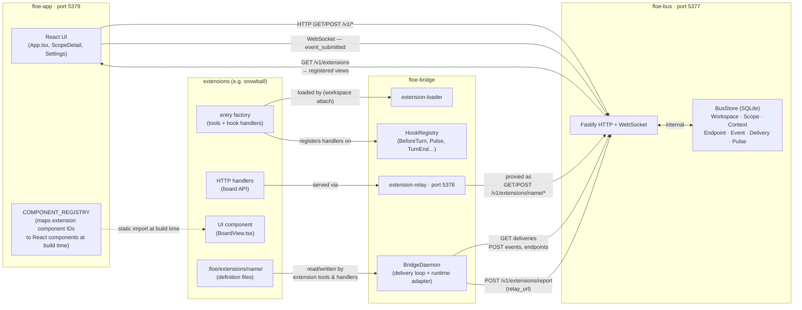

**Desktop path (Tauri, optional):** `SubstrateSettingsView` auth-write operations bypass the bus
and go directly through Tauri IPC to the local filesystem (ADR-0005). The bus never exposes
auth-write endpoints.

---

### 1.1 Substrate Primitives (`floe-bus`)

The bus is the canonical event store and the only mutable substrate daemon.
All state is SQLite; all structural definitions live in files under `.floe/`.

**Key invariant (`floe-bus/src/store.ts` header):** `BusStore` is the sole mutable
substrate store for bus-owned records. No parallel runtime state.

#### Core primitive relationships

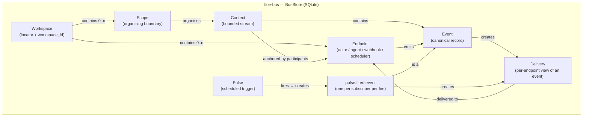

**Context anchoring rules (ADR-0004 + `floe-bus/src/contexts/store.ts`):**

- A Context must be anchored by actor participants, a Scope, or both.
- A Context with no actor participants **must** have a non-null `scope_id`.
- A Context with actor participants may have `scope_id: null` (workspace-level conversation).
- Participants are **frozen** at creation — there is no add/remove participant API
  (`floe-bus/src/contexts/integration.test.ts` T10).
- `parent_context_id` allows hierarchical nesting (e.g. sub-conversations).

**Pulse = scheduled event (ADR-0001, `floe-bus/src/server.ts:firePulse`):**

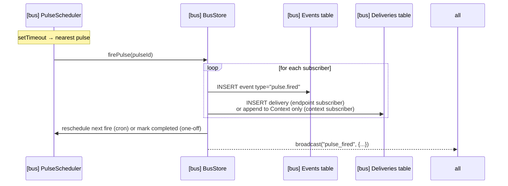

- Pulse **definitions** live in `.floe/floe.yaml` — committed, portable.
- Pulse **runtime state** (next_fire_at, last_fired) lives in SQLite — local, ephemeral.
- `PulseScheduler` (`floe-bus/src/pulse-scheduler.ts`) uses a single `setTimeout` sorted by next fire time; zero CPU cost at rest.
- A **context subscriber** appends `pulse.fired` to an existing Context for rendering only (no delivery created).
- An **endpoint subscriber** creates a Delivery; the bus reuses a stable generated scoped Context per pulse+subscriber, rather than creating a new Context on every fire.

**Emit / event routing (`floe-bus/src/store.ts:submitEvent`):**

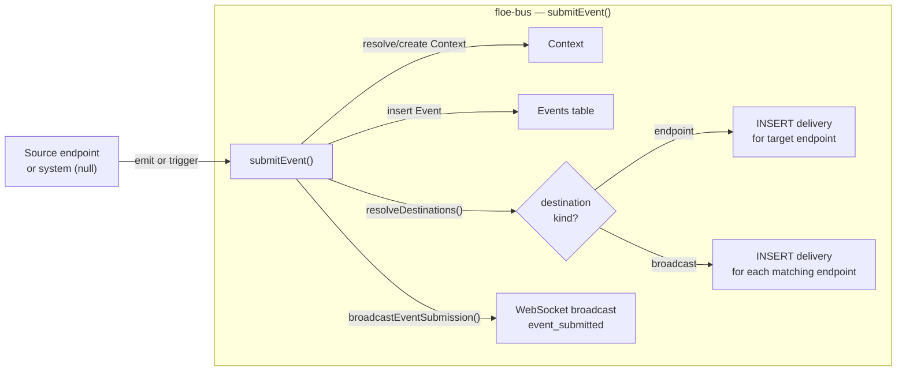

- `source_endpoint_id` is null for system-originated events (pulse.fired, webhook ingest).
- Broadcast targets are delivery-processor-based (e.g. `active_with_delivery_processor`) — actor-neutral.
- Context resolution: if `context_id` is supplied and source is not a participant → rejected with `E_NOT_CONTEXT_PARTICIPANT`.

---

### 1.2 Runtime Boundary (`floe-bridge`)

The bridge is the sole owner of effective runtime embodiment. It processes
event deliveries and runs agent turns.

#### Adapter selection and hook flow

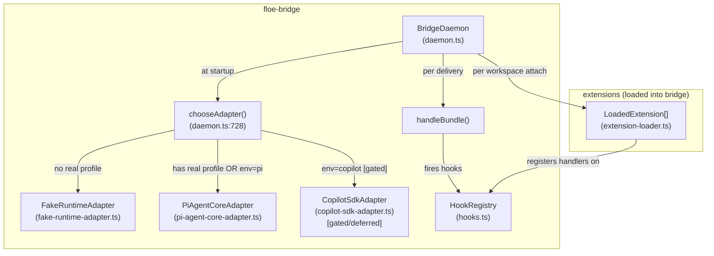

**Adapter selection logic** (`daemon.ts:chooseAdapter`):
- `FLOE_RUNTIME_ADAPTER` env var overrides config.
- If no override: presence of a non-fake auth profile → `PiAgentCoreAdapter`; otherwise `FakeRuntimeAdapter`.
- `CopilotSdkAdapter` exists but is intentionally gated behind `FLOE_LIVE_COPILOT=1` and throws (deferred).

**RuntimeAdapter interface** (`floe-bridge/src/adapters/runtime-adapter.ts`):

```typescript
interface RuntimeAdapter {
  readonly name: string;
  handleBundle(context: RuntimeContext, bundle: DeliveryBundle, runtimeConfig?: AgentRuntimeConfig): Promise<void>;
  dispose?(reason?: HookPayload<"SessionEnd">["reason"]): Promise<void>;
}
```

#### Extension lifecycle

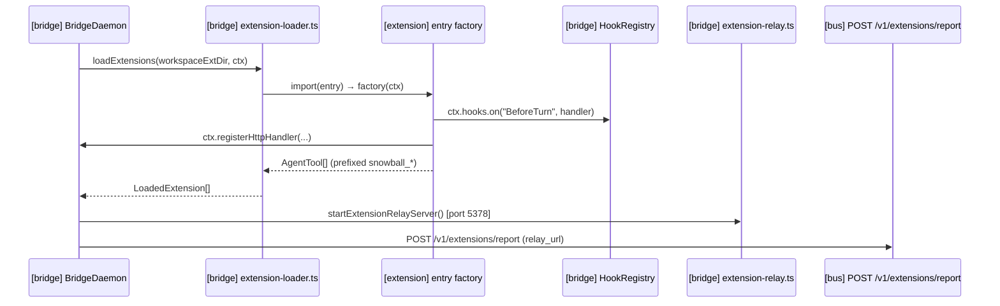

#### Hooks fired at runtime (all hooks from `floe-bridge/src/hooks.ts`)

| Hook | When | Active behaviour |
|---|---|---|
| `SessionStart` | New LLM session created | Observation |
| `SessionResume` | Existing session reused | Observation |
| `BeforeTurn` | Before each agent turn | **Injection** — handler may return `{ inject: { source, content } }` to add context to the prompt |
| `TurnEnd` | After agent turn completes | Observation (visible_output, tool_activity, emitted_events) |
| `BeforeToolUse` | Before each tool call | Observation |
| `AfterToolUse` | After successful tool call | Observation |
| `ToolUseFailed` | After failed tool call | Observation |
| `Pulse` | When `pulse.fired` delivery is processed | Observation / side-effect trigger |
| `WebhookReceived` | When webhook ingest event is processed | Observation |
| `SessionEnd` | Session replaced or bridge shutting down | Observation |
| `Error` | Unrecoverable turn error | Observation |

Handlers run sequentially in registration order; failures are caught and logged, never crashing the adapter.

---

### 1.3 UI Surface (`floe-app`)

One UI surface on port 5379: works in a plain browser and is wrapped by the
Tauri desktop shell (ADR-0005, `floe-app/src-tauri/`). Same vite frontend;
Tauri adds local IPC for auth-write operations.

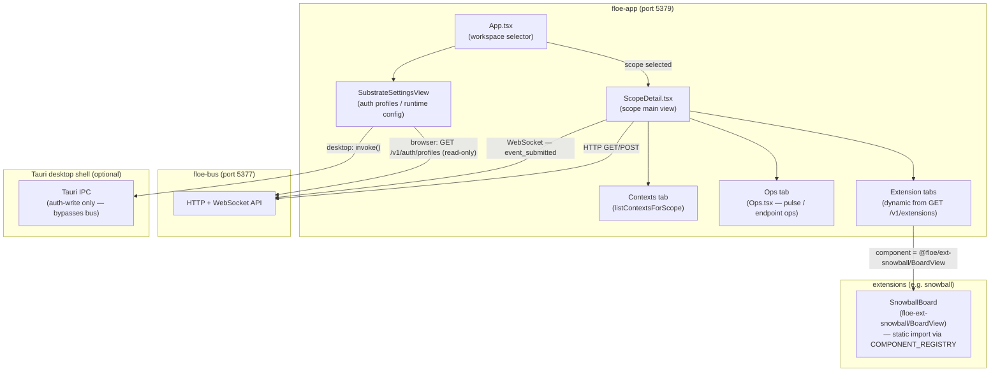

**Extension view registration** (`ScopeDetail.tsx`):
- `GET /v1/extensions?workspace_id=X` returns extension manifests with declared views.
- Views with `slot: "scope-detail-tab"` are added as dynamic tabs alongside built-in Contexts/Ops tabs.
- The `COMPONENT_REGISTRY` map resolves component identifiers to React components at build time.
- `contextLabel` prefers `title` over `first_message_preview`.

---

### 1.4 Snowball Extension — Current State (`floe-ext-snowball`)

> **Foundation Slices 1+2 (`fm/snowball-found-s1` + `fm/snowball-col-instr-s2`) shipped.**
> Cards are committed files. Columns are now ALSO committed definition files with
> agent instructions in the body. This section reflects post-slice-2 reality.

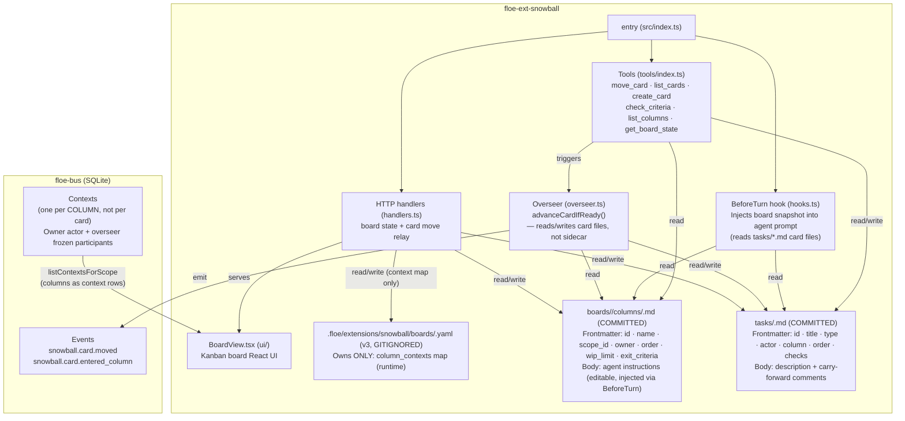

**What Snowball owns (post-slice-2):**

- **Column definition files** (`boards/<slug>/columns/<id>.md`, **committed + diffable**) own column config: `id`, `name`, `scope_id`, `order`, `wip_limit`, `owner` (kind + agent_id), `exit_criteria`. **Body = agent instructions** (free-form markdown, editable in Board UI, injected via BeforeTurn).
- **Sidecar YAML** (`.floe/extensions/snowball/boards/<slug>.yaml`, schema `floe.ext.snowball.board.v3`, **gitignored**) now owns ONLY the `column_contexts` map (`column_id → bus Context id`). Column definitions removed. Populated by `POST /board/init` (idempotent).
- **`slugify()`** maps `scope_id → filesystem slug` (replaces `:`, `/`, `\` with `_` for Windows-safe filenames).
- **Card files** (`tasks/<id>.md`, **committed**) are the source of truth for card state. Frontmatter: `id`, `title`, `type`, `actor`, `column` (updated in-place on move, file never moves — D1), `order`, `created_at`, `checks`. Body: description + appended carry-forward comments.
- **Column = bus Context**: `POST /board/init` creates one bus Context per column (scoped to board scope_id), with column owner actor + `snowball-overseer` as frozen participants. Context ids stored in `column_contexts` (sidecar).
- **Columns as context rows**: `listContextsForScope` returns column contexts — the UI Contexts tab shows columns, not cards.
- **Card-move path**: rewrites `column` frontmatter in-place, appends `<!-- carry-forward from "ColumnName" at ISO -->` comment to body, emits `snowball.card.entered_column` (for agent-owned columns) into the column context. All emits include `scope_id` so any fallback-created contexts are always board-scoped (never stray no-scope contexts).
- **Lazy board init on move**: `handlePostMove` lazily calls `initBoardContexts` when the destination agent-owned column has no column context in the sidecar (e.g. board never initialized, or context evicted after owner change). This ensures `entered_column` routing always targets a scoped column context.
- **Owner-change eviction**: `handlePostColumns` action:update evicts the column context from the sidecar when the column owner changes to an agent, so the next move triggers a lazy re-init with the new agent as a participant.
- **BeforeTurn injection**: reads column files + card files. Column workers receive their column's instructions + card list. Overseer receives full board snapshot + all columns' instructions. Board discovery uses committed `boards/` directory (works after clone — no sidecar needed).
- **Overseer** (`advanceCardIfReady`) reads column definitions from column files (not sidecar). Maximum 20-column cascade guard.
- **Gate enforcement**: AI `move_card` hard-blocked by unchecked exit criteria (read from column files); human `force=true` is soft-warn; WIP limits hard-block both.
- **Column instructions UI**: `ColumnConfigPanel` includes an "Agent Instructions" textarea. Saving writes the column file body via `POST /column/instructions` (the file IS the source of truth). Instructions are committed and diffable.
- **Overseer agent** (`snowball-overseer`) registered in memory at workspace attach — no disk write, no `floe.yaml` modification.

**State/runtime split (post-slice-2 — §2.4 fully realized for columns):**

| What | Where | Tracked? |
|---|---|---|
| Column definitions (name, owner, exit-criteria, WIP) | Column file frontmatter (`boards/<slug>/columns/<id>.md`) | ✅ Committed |
| Column agent instructions | Column file body (`boards/<slug>/columns/<id>.md`) | ✅ Committed |
| Column context ids | Sidecar YAML (`column_contexts` map, v3, gitignored) | ❌ Runtime scratch |
| Card definition (type, description, comments) | Card file (`tasks/<id>.md`) | ✅ Committed |
| Card current column + order | Card file frontmatter (updated in-place on move) | ✅ Committed |
| Column contexts (stable, scoped) | Bus SQLite (created at board init) | ❌ Runtime |
| Card-move events | Bus SQLite | ❌ Runtime |
---

## Part 2 — Target Model

> **This section is aspirational / target state.**  
> Items here represent agreed direction but are NOT yet in the code.
> Do not treat this section as current-state documentation.

---

### 2.0 Substrate vs Extension — What Belongs Where

A future agent building a *different* extension must know exactly which
capabilities come from the general substrate and which are Snowball-specific
applications of those primitives. Snowball is an example consumer of the
substrate — not part of it.

| Concept | Owner | Available to any extension? |
|---|---|---|
| Workspaces, Scopes, Contexts | **Substrate** (`floe-bus`) | ✅ Yes |
| Events, Deliveries, Endpoints | **Substrate** (`floe-bus`) | ✅ Yes |
| Pulses (`pulse.fired`) | **Substrate** (`floe-bus`) | ✅ Yes |
| Hooks (`BeforeTurn`, `Pulse`, `TurnEnd`, …) | **Substrate** (`floe-bridge`) | ✅ Yes — register via `ExtensionContext.hooks.on(...)` |
| HTTP relay (`GET/POST /v1/extensions/name/*`) | **Substrate** (`floe-bridge` + `floe-bus`) | ✅ Yes — declare handlers via `ctx.registerHttpHandler(...)` |
| Scope-detail tab views | **Substrate** (`floe-app` COMPONENT_REGISTRY) | ✅ Yes — declare `views` in extension manifest |
| Tool namespacing (auto-prefix) | **Substrate** (`extension-loader`) | ✅ Yes — automatic for all extensions |
| Agent bundling (in-memory, no disk write) | **Substrate** (`floe-bridge` + `floe-bus`) | ✅ Yes — declare `agents` in extension manifest |
| **Boards** (column config, accepted card type) | **Snowball-specific** | ❌ No |
| **Columns as Contexts** | **Snowball's use** of substrate Contexts | ❌ No |
| **Cards** (markdown files with YAML frontmatter) | **Snowball-specific** | ❌ No |
| **Exit criteria** (per-column gate logic) | **Snowball-specific** | ❌ No |
| **Overseer agent** (`snowball-overseer`) | **Snowball-specific** | ❌ No |
| **WIP limits** | **Snowball-specific** | ❌ No |
| **Carry-forward comments** | **Snowball-specific** | ❌ No |

> **Rule:** if Snowball deleted tomorrow, the substrate (bus, bridge, app) must
> be completely unmodified. Snowball only calls substrate APIs — it never adds
> to them.

---

### 2.1 File-First Philosophy

> **Realized for cards (`fm/snowball-found-s1`) and columns (`fm/snowball-col-instr-s2`).**

Everything in Floe is a committable, diffable file.

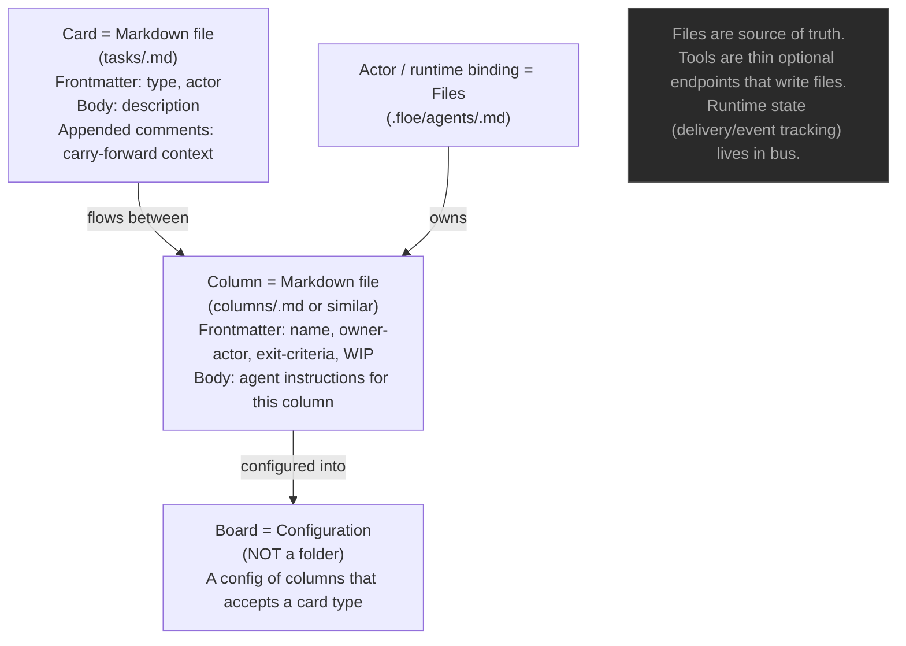

**Invariants:**
- A card's persistent identity is its file path, not a generated UUID.
- A column's agent instructions live in the column file body — no separate instructions store.
- Any tool that "creates a card" is writing a markdown file; the bus event is the notification, not the storage.

---

### 2.2 Extensions as Thin Glue

Extensions must integrate INTO substrate primitives — not build parallel state stores.

**Snowball realignment target:**

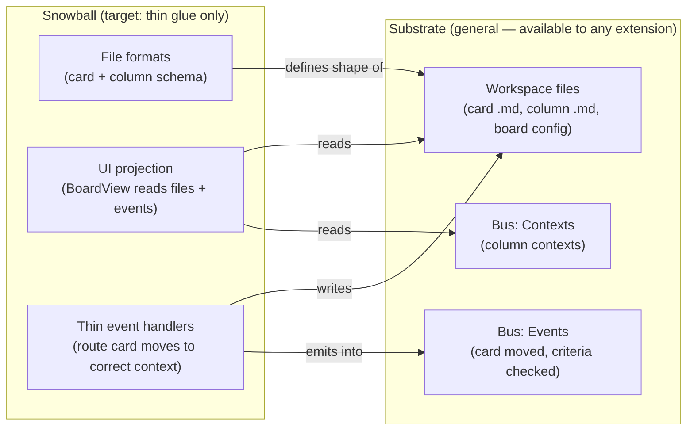

**What Snowball must NOT do in the target:**
- Own a parallel sidecar that is the source of truth for mutable runtime state.
- Build its own event handlers or polling mechanism outside the hook/event substrate.
- Maintain its own context/participant management separate from the bus.

---

### 2.3 Column = Context (decided); Card = File

**Decided context granularity:**

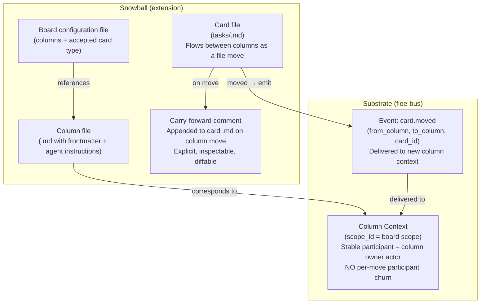

**Rules (decided):**
- A **column** is a Context. Its stable participant is the column owner actor. Participants are set at column creation and do not change when cards move through.
- A **card** is a file that flows between column-contexts as events.
- A card **intentionally loses** per-column context on move — carry-forward is an explicit comment appended to the card file.
- **Ruled out**: snowball-as-one-context (all cards in one context → no isolation); board-as-the-working-context (too coarse).

---

### 2.4 Definitions-in-Files / Runtime-in-Bus Split

> **Fully realized for cards and columns as of `fm/snowball-col-instr-s2`.**
> Following the ADR-0001 model (pulse definitions in `.floe/`, runtime in SQLite):

| What | Home | Committed? |
|---|---|---|
| Card definition (type, description, comments) | `tasks/<id>.md` | ✅ Yes |
| Column definition (name, owner, exit-criteria, WIP, agent instructions) | `boards/<slug>/columns/<id>.md` | ✅ Yes |
| Board definition (column list, accepted card type) | Implied by column files; `boards/<slug>/` directory | ✅ Yes |
| Column context ids | Sidecar YAML (`column_contexts` map, gitignored) | ❌ No — runtime |
| Column context (stable, scoped) | Bus SQLite (created at board init) | ❌ No — runtime |
| Card-move events | Bus SQLite | ❌ No — runtime |
| Exit-criteria check events | Bus SQLite | ❌ No — runtime |
| Watermarks / delivery state | Bus SQLite | ❌ No — runtime |

---

### 2.5 Pulse / Event / Hook Unification Note

> **Current state:** hooks are session/turn lifecycle only. Pulses create `pulse.fired` events delivered to endpoints. Events are the reaction currency.

**Relationship (target and current):**

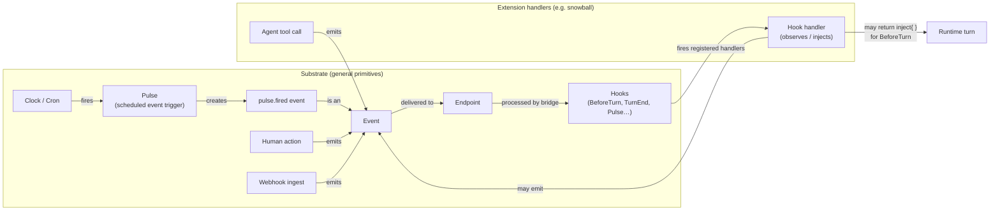

- A pulse is just a scheduled event — no special processing path beyond creation.
- Events are the reaction currency; hooks are observation/injection points on the processing lifecycle.
- Today's hooks are session/turn lifecycle only. Future: domain-event hooks (e.g. `card.moved`) are not yet designed.

---

## Part 3 — Open Questions

> These are deliberately unresolved. Do not answer them here — flag them for the captain.

| # | Question | Why deferred |
|---|---|---|
| OQ-1 | **Board semantics**: is a board a Scope, or a config/lens over cards that could span scopes? | Start with one board per scope; multi-board hierarchy (epics → tasks → subtasks, cross-board exit criteria) is undesigned. |
| OQ-2 | **Multi-board hierarchy**: epics on a higher board, tasks on a lower board, cross-board exit criteria ("all child tasks validated + PR-ready"). | Requires scoped membership model and cross-scope event routing, neither of which is decided. |
| OQ-3 | **Overseer observation model**: how does the overseer "observe" the system to know when exit criteria are satisfied without a polling/heartbeat mechanism? | Near-term: overseer is a file-authoring systems agent, not a work manager. Full reactive observation model not yet designed. |
| OQ-4 | **Domain-event hooks**: should extensions register handlers on domain events (e.g. `card.moved`) rather than lifecycle hooks (BeforeTurn)? | Hook system currently covers session/turn lifecycle only. Extending to arbitrary event types requires design. |
| ~~OQ-5~~ | **Card identity across moves** — **RESOLVED** (fm/snowball-found-s1): identity is the stable frontmatter `id` field. The card file STAYS in `tasks/` and is NEVER moved. The current column is a frontmatter field updated in-place. Carry-forward is by appended comment. File rename does not affect card identity (`id` frontmatter is stable). | Resolved — see §1.4 and D1. |

---

## Cross-references

| Document | Role |
|---|---|
| [`architecture.map.yaml`](../../architecture.map.yaml) | Machine-readable ownership map (clusters, cells, modules, write-authority, path globs). This doc is the human-facing companion. |
| [`CONTEXT.md`](../../CONTEXT.md) | Canonical terminology and invariants. Definitions here are authoritative for all code and docs. |
| [`docs/adr/0001-pulse-scheduled-event-delivery.md`](../adr/0001-pulse-scheduled-event-delivery.md) | Pulse = scheduled event; definitions-in-files / runtime-in-bus split; event-driven scheduler. |
| [`docs/adr/0002-extension-substrate-design.md`](../adr/0002-extension-substrate-design.md) | Extension manifest format, factory function entry, hook registration model, tool namespacing. |
| [`docs/adr/0003-field-substrate-primitive.md`](../adr/0003-field-substrate-primitive.md) | Field as FloeWeb rendering of Scope (superseded by ADR-0004 for ownership questions). |
| [`docs/adr/0004-scope-as-substrate-organising-boundary.md`](../adr/0004-scope-as-substrate-organising-boundary.md) | Scope is the organising boundary; contexts may be scope-anchored or actor-anchored; no default scope. |
| [`docs/adr/0005-file-access-patterns.md`](../adr/0005-file-access-patterns.md) | File access: Tauri IPC for desktop auth-write; agent file writes sandboxed to workspace locator; no remote HTTP file-write. |
| [`docs/substrate-semantics.md`](../substrate-semantics.md) | Endpoint equality, event as primitive, turn as lifecycle, chat as a view. Substrate doctrine. |
