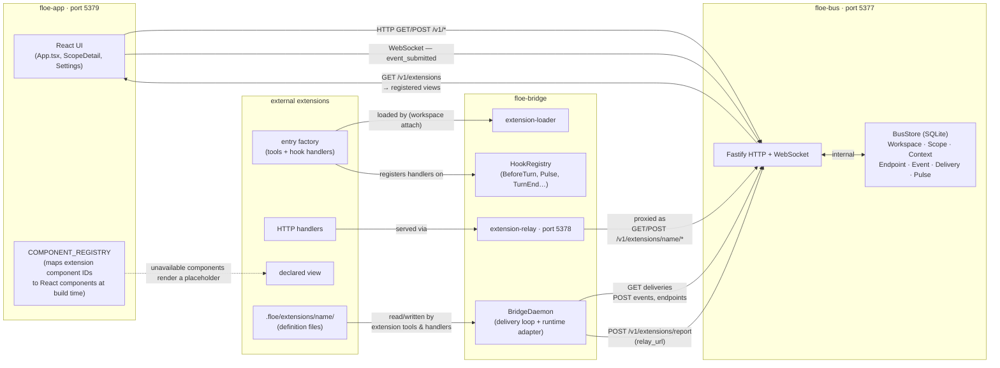
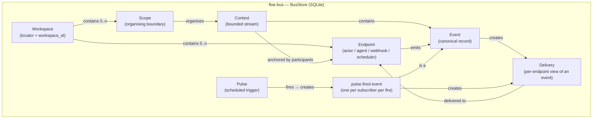
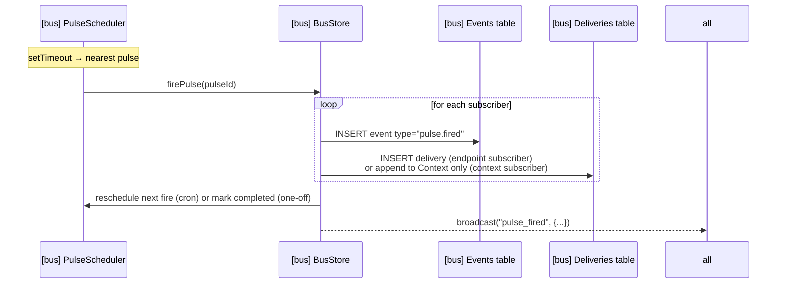
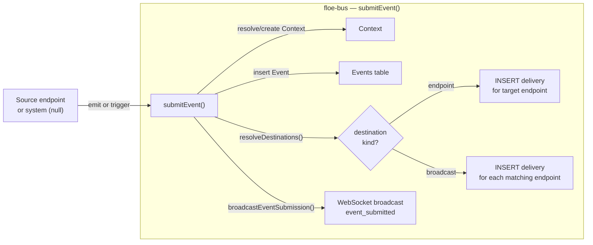
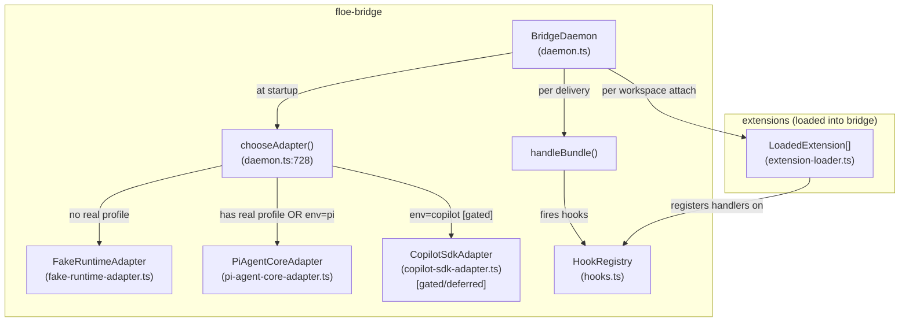
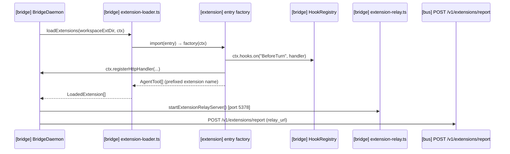
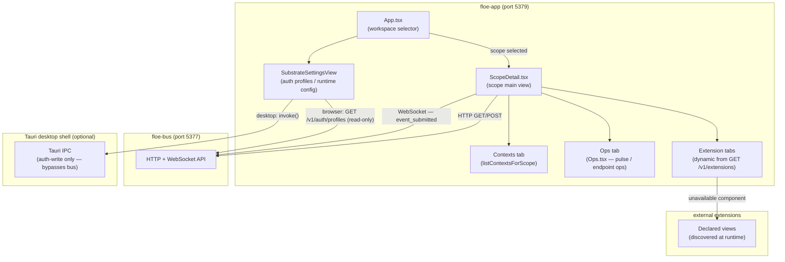
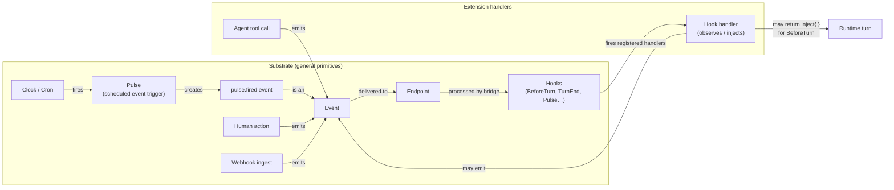

# Floe Substrate — Living Architecture Graph

> **How to evolve this document**
>
> This is the living architecture graph. Every slice reassesses and augments it.
> Before merging a slice: (1) verify current-state diagrams still reflect the code,
> (2) move any items that shipped from "Target / Aspirational" to "Current State",
> (3) flag any new open questions.
>
> Machine-readable ownership map: [`architecture.map.yaml`](../../architecture.map.yaml)
> (clusters → cells → modules with write-authority and path globs).  
> This document is the human-facing companion: it explains *why* things are shaped as
> they are and where they are going, and renders as diagrams on GitHub.  
> Canonical terminology lives in [`CONTEXT.md`](../../CONTEXT.md).  
> Accepted decisions live in [`docs/adr/`](../adr/).

---

## Part 1 — Current State

Grounded in the code as of the time of writing. Every claim is anchored to a
real file so a future reader can verify or correct it.

---

### 1.0 System Domains & Seams

The four domains and the mechanisms connecting them. Read this first — the sections
below zoom in on each domain independently.


```mermaid
graph LR
    subgraph APP["floe-app · port 5379"]
        UI["React UI\n(App.tsx, ScopeDetail, Settings)"]
        CREG["COMPONENT_REGISTRY\n(maps extension component IDs\nto React components at build time)"]
    end

    subgraph BUS["floe-bus · port 5377"]
        BHTTP["Fastify HTTP + WebSocket"]
        BSTORE["BusStore (SQLite)\nWorkspace · Scope · Context\nEndpoint · Event · Delivery · Pulse"]
        BHTTP <-->|"internal"| BSTORE
    end

    subgraph BRIDGE["floe-bridge"]
        DAEMON["BridgeDaemon\n(delivery loop + runtime adapter)"]
        HOOKS["HookRegistry\n(BeforeTurn, Pulse, TurnEnd…)"]
        LOADER["extension-loader"]
        RELAY["extension-relay · port 5378"]
    end

    subgraph EXTS["external extensions"]
        ENTRY["entry factory\n(tools + hook handlers)"]
        EHTTP["HTTP handlers"]
        EVIEW["declared view"]
        EFILES[".floe/extensions/name/\n(definition files)"]
    end

    UI -->|"HTTP GET/POST /v1/*"| BHTTP
    UI -->|"WebSocket — event_submitted"| BHTTP
    BHTTP -->|"GET /v1/extensions\n→ registered views"| UI
    CREG -.->|"unavailable components render a placeholder"| EVIEW

    DAEMON -->|"GET deliveries\nPOST events, endpoints"| BHTTP
    DAEMON -->|"POST /v1/extensions/report\n(relay_url)"| BHTTP

    ENTRY -->|"loaded by (workspace attach)"| LOADER
    ENTRY -->|"registers handlers on"| HOOKS
    EHTTP -->|"served via"| RELAY
    RELAY -->|"proxied as\nGET/POST /v1/extensions/name/*"| BHTTP

    EFILES -->|"read/written by\nextension tools & handlers"| DAEMON
```

**Desktop path (Tauri, optional):** `SubstrateSettingsView` auth-write operations bypass the bus
and go directly through Tauri IPC to the local filesystem (ADR-0005). The bus never exposes
auth-write endpoints.

---

### 1.1 Substrate Primitives (`floe-bus`)

The bus is the canonical event store and the only mutable substrate daemon.
All state is SQLite; all structural definitions live in files under `.floe/`.

**Key invariant (`floe-bus/src/store.ts` header):** `BusStore` is the sole mutable
substrate store for bus-owned records. No parallel runtime state.

#### Core primitive relationships


```mermaid
graph TD
    subgraph BUS["floe-bus — BusStore (SQLite)"]
        WS["Workspace\n(locator + workspace_id)"]
        SC["Scope\n(organising boundary)"]
        CTX["Context\n(bounded stream)"]
        EP["Endpoint\n(actor / agent / webhook / scheduler)"]
        EV["Event\n(canonical record)"]
        DEL["Delivery\n(per-endpoint view of an event)"]
        PL["Pulse\n(scheduled trigger)"]
        PF["pulse.fired event\n(one per subscriber per fire)"]
    end

    WS -->|"contains 0..n"| SC
    WS -->|"contains 0..n"| EP
    SC -->|"organises"| CTX
    CTX -->|"anchored by participants"| EP
    CTX -->|"contains"| EV
    EP -->|"emits"| EV
    EV -->|"creates"| DEL
    DEL -->|"delivered to"| EP
    PL -->|"fires → creates"| PF
    PF -->|"is a"| EV
    PF -->|"creates"| DEL
```

**Context anchoring rules (ADR-0004 + `floe-bus/src/contexts/store.ts`):**

- A Context must be anchored by actor participants, a Scope, or both.
- A Context with no actor participants **must** have a non-null `scope_id`.
- A Context with actor participants may have `scope_id: null` (workspace-level conversation).
- Participants are **frozen** at creation — there is no add/remove participant API
  (`floe-bus/src/contexts/integration.test.ts` T10).
- `parent_context_id` allows hierarchical nesting (e.g. sub-conversations).

**Pulse = scheduled event (ADR-0001, `floe-bus/src/server.ts:firePulse`):**


```mermaid
sequenceDiagram
    participant PS as [bus] PulseScheduler
    participant BUS as [bus] BusStore
    participant EV as [bus] Events table
    participant DEL as [bus] Deliveries table

    Note over PS: setTimeout → nearest pulse
    PS->>BUS: firePulse(pulseId)
    loop for each subscriber
        BUS->>EV: INSERT event type="pulse.fired"
        BUS->>DEL: INSERT delivery (endpoint subscriber)<br/>or append to Context only (context subscriber)
    end
    BUS->>PS: reschedule next fire (cron) or mark completed (one-off)
    BUS-->>all: broadcast("pulse_fired", {...})
```

- Pulse **definitions** live in `.floe/floe.yaml` — committed, portable.
- Pulse **runtime state** (next_fire_at, last_fired) lives in SQLite — local, ephemeral.
- `PulseScheduler` (`floe-bus/src/pulse-scheduler.ts`) uses a single `setTimeout` sorted by next fire time; zero CPU cost at rest.
- A **context subscriber** appends `pulse.fired` to an existing Context for rendering only (no delivery created).
- An **endpoint subscriber** creates a Delivery; the bus reuses a stable generated scoped Context per pulse+subscriber, rather than creating a new Context on every fire.

**Emit / event routing (`floe-bus/src/store.ts:submitEvent`):**


```mermaid
graph LR
    SRC["Source endpoint\nor system (null)"] -->|"emit or trigger"| SE

    subgraph BUS["floe-bus — submitEvent()"]
        SE["submitEvent()"]
        SE -->|"resolve/create Context"| CTX["Context"]
        SE -->|"insert Event"| EV["Events table"]
        SE -->|"resolveDestinations()"| DST{"destination\nkind?"}
        DST -->|endpoint| D1["INSERT delivery\nfor target endpoint"]
        DST -->|broadcast| D2["INSERT delivery\nfor each matching endpoint"]
        SE -->|"broadcastEventSubmission()"| WS["WebSocket broadcast\nevent_submitted"]
    end
```

- `source_endpoint_id` is null for system-originated events (pulse.fired, webhook ingest).
- Broadcast targets are delivery-processor-based (e.g. `active_with_delivery_processor`) — actor-neutral.
- Context resolution: if `context_id` is supplied and source is not a participant → rejected with `E_NOT_CONTEXT_PARTICIPANT`.

---

### 1.2 Runtime Boundary (`floe-bridge`)

The bridge is the sole owner of effective runtime embodiment. It processes
event deliveries and runs agent turns.

#### Adapter selection and hook flow


```mermaid
graph TD
    subgraph BRIDGE["floe-bridge"]
        BD["BridgeDaemon\n(daemon.ts)"]
        CA["chooseAdapter()\n(daemon.ts:728)"]
        FA["FakeRuntimeAdapter\n(fake-runtime-adapter.ts)"]
        PA["PiAgentCoreAdapter\n(pi-agent-core-adapter.ts)"]
        CS["CopilotSdkAdapter\n(copilot-sdk-adapter.ts)\n[gated/deferred]"]
        HR["HookRegistry\n(hooks.ts)"]
        TURN["handleBundle()"]
    end

    subgraph EXTS["extensions (loaded into bridge)"]
        EXT["LoadedExtension[]\n(extension-loader.ts)"]
    end

    BD -->|"at startup"| CA
    CA -->|"no real profile"| FA
    CA -->|"has real profile OR env=pi"| PA
    CA -->|"env=copilot [gated]"| CS

    BD -->|"per workspace attach"| EXT
    EXT -->|"registers handlers on"| HR
    BD -->|"per delivery"| TURN
    TURN -->|"fires hooks"| HR
```

**Adapter selection logic** (`daemon.ts:chooseAdapter`):
- `FLOE_RUNTIME_ADAPTER` env var overrides config.
- If no override: presence of a non-fake auth profile → `PiAgentCoreAdapter`; otherwise `FakeRuntimeAdapter`.
- `CopilotSdkAdapter` exists but is intentionally gated behind `FLOE_LIVE_COPILOT=1` and throws (deferred).

**RuntimeAdapter interface** (`floe-bridge/src/adapters/runtime-adapter.ts`):

```typescript
interface RuntimeAdapter {
  readonly name: string;
  handleBundle(context: RuntimeContext, bundle: DeliveryBundle, runtimeConfig?: AgentRuntimeConfig): Promise<void>;
  dispose?(reason?: HookPayload<"SessionEnd">["reason"]): Promise<void>;
}
```

#### Extension lifecycle


```mermaid
sequenceDiagram
    participant BD as [bridge] BridgeDaemon
    participant EL as [bridge] extension-loader.ts
    participant EXT as [extension] entry factory
    participant HR as [bridge] HookRegistry
    participant RL as [bridge] extension-relay.ts
    participant BUS as [bus] POST /v1/extensions/report

    BD->>EL: loadExtensions(workspaceExtDir, ctx)
    EL->>EXT: import(entry) → factory(ctx)
    EXT->>HR: ctx.hooks.on("BeforeTurn", handler)
    EXT->>BD: ctx.registerHttpHandler(...)
    EXT-->>EL: AgentTool[] (prefixed extension name)
    EL-->>BD: LoadedExtension[]
    BD->>RL: startExtensionRelayServer() [port 5378]
    BD->>BUS: POST /v1/extensions/report (relay_url)
```

#### Hooks fired at runtime (all hooks from `floe-bridge/src/hooks.ts`)

| Hook | When | Active behaviour |
|---|---|---|
| `SessionStart` | New LLM session created | Observation |
| `SessionResume` | Existing session reused | Observation |
| `BeforeTurn` | Before each agent turn | **Injection** — handler may return `{ inject: { source, content } }` to add context to the prompt |
| `TurnEnd` | After agent turn completes | Observation (visible_output, tool_activity, emitted_events) |
| `BeforeToolUse` | Before each tool call | Observation |
| `AfterToolUse` | After successful tool call | Observation |
| `ToolUseFailed` | After failed tool call | Observation |
| `Pulse` | When `pulse.fired` delivery is processed | Observation / side-effect trigger |
| `WebhookReceived` | When webhook ingest event is processed | Observation |
| `SessionEnd` | Session replaced or bridge shutting down | Observation |
| `Error` | Unrecoverable turn error | Observation |

Handlers run sequentially in registration order; failures are caught and logged, never crashing the adapter.

---

### 1.3 UI Surface (`floe-app`)

One UI surface on port 5379: works in a plain browser and is wrapped by the
Tauri desktop shell (ADR-0005, `floe-app/src-tauri/`). Same vite frontend;
Tauri adds local IPC for auth-write operations.


```mermaid
graph TD
    subgraph APP["floe-app (port 5379)"]
        APPX["App.tsx\n(workspace selector)"]
        SD["ScopeDetail.tsx\n(scope main view)"]
        CTX_LIST["Contexts tab\n(listContextsForScope)"]
        OPS["Ops tab\n(Ops.tsx — pulse / endpoint ops)"]
        EXT_TABS["Extension tabs\n(dynamic from GET /v1/extensions)"]
        SS["SubstrateSettingsView\n(auth profiles / runtime config)"]
    end

    subgraph EXT["external extensions"]
        EV["Declared views\n(discovered at runtime)"]
    end

    subgraph BUS["floe-bus (port 5377)"]
        BAPI["HTTP + WebSocket API"]
    end

    subgraph DESKTOP["Tauri desktop shell (optional)"]
        TAURI["Tauri IPC\n(auth-write only — bypasses bus)"]
    end

    APPX -->|"scope selected"| SD
    SD --> CTX_LIST
    SD --> OPS
    SD --> EXT_TABS
    EXT_TABS -->|"unavailable component"| EV
    APPX --> SS
    SS -->|"browser: GET /v1/auth/profiles (read-only)"| BAPI
    SS -->|"desktop: invoke()"| TAURI

    SD -->|"WebSocket — event_submitted"| BAPI
    SD -->|"HTTP GET/POST"| BAPI
```

**Extension view registration** (`ScopeDetail.tsx`):
- `GET /v1/extensions?workspace_id=X` returns extension manifests with declared views.
- Views with `slot: "scope-detail-tab"` are added as dynamic tabs alongside built-in Contexts/Ops tabs.
- A declared component without an in-repo implementation renders `PlaceholderExtensionView`; runtime loading of external view components is not implemented.
- `contextLabel` prefers `title` over `first_message_preview`.

---

## Part 2 — Target Model

> **This section is aspirational / target state.**  
> Items here represent agreed direction but are NOT yet in the code.
> Do not treat this section as current-state documentation.

---

### 2.0 Substrate vs Extension — What Belongs Where

Extensions are independent consumers of the substrate. They define their own product semantics and durable state; the substrate owns shared coordination and runtime contracts.

| Concept | Owner | Available to any extension? |
|---|---|---|
| Workspaces, Scopes, Contexts | **Substrate** (`floe-bus`) | ✅ Yes |
| Events, Deliveries, Endpoints | **Substrate** (`floe-bus`) | ✅ Yes |
| Pulses (`pulse.fired`) | **Substrate** (`floe-bus`) | ✅ Yes |
| Hooks (`BeforeTurn`, `Pulse`, `TurnEnd`, …) | **Substrate** (`floe-bridge`) | ✅ Yes — register via `ExtensionContext.hooks.on(...)` |
| HTTP relay (`GET/POST /v1/extensions/name/*`) | **Substrate** (`floe-bridge` + `floe-bus`) | ✅ Yes — declare handlers via `ctx.registerHttpHandler(...)` |
| Extension-view discovery | **Substrate** (`floe-bus` + `floe-app`) | ✅ Yes — declare `views` in the manifest; unavailable components render a placeholder |
| Tool namespacing (auto-prefix) | **Substrate** (`extension-loader`) | ✅ Yes — automatic for all extensions |
| Agent bundling (in-memory, no disk write) | **Substrate** (`floe-bridge` + `floe-bus`) | ✅ Yes — declare `agents` in the manifest |
| Product domain, file formats, and business rules | **Extension** | ❌ No |

> **Rule:** deleting an extension must leave the substrate (bus, bridge, and app) unmodified. Extensions call substrate APIs; they do not add product semantics to them.

---

### 2.1 Extensions as Thin Glue

Extensions integrate into substrate primitives; they must not build parallel stores for substrate-owned mutable state.

- Extension-owned definitions and product state belong to the extension workspace files or its own storage contract.
- The bus owns contexts, events, deliveries, subscriptions, and runtime state.
- Extension hooks and handlers use the normal event and delivery paths; they do not introduce polling loops or separate participant management.
- Tools are optional interfaces to extension-owned state. Events notify and route work; they are not a replacement for durable product state.

---

### 2.2 Definitions-in-Files / Runtime-in-Bus Split

Following ADR-0001, human-authored definitions are committed and portable; bus runtime state is local and ephemeral. An extension may define its own durable files, but it must not treat runtime scratch state as committed configuration.

| What | Home | Committed? |
|---|---|---|
| Project configuration | `.floe/floe.yaml` | ✅ Yes |
| Extension definitions and product state | Extension-owned contract | Extension-defined |
| Contexts, events, deliveries, subscriptions, and watermarks | Bus SQLite | ❌ No — runtime |

---
### 2.3 Pulse / Event / Hook Unification Note

> **Current state:** hooks are session/turn lifecycle only. Pulses create `pulse.fired` events delivered to endpoints. Events are the reaction currency.

**Relationship (target and current):**


```mermaid
graph LR
    subgraph SUB["Substrate (general primitives)"]
        SCHED["Clock / Cron"] -->|"fires"| PL["Pulse\n(scheduled event trigger)"]
        PL -->|"creates"| PFE["pulse.fired event"]
        PFE -->|"is an"| EV["Event"]
        HUM["Human action"] -->|"emits"| EV
        WH["Webhook ingest"] -->|"emits"| EV
        EV -->|"delivered to"| EP["Endpoint"]
        EP -->|"processed by bridge"| HOOKS["Hooks\n(BeforeTurn, TurnEnd, Pulse…)"]
    end

    subgraph EXT["Extension handlers"]
        HNDL["Hook handler\n(observes / injects)"]
        AGT["Agent tool call"] -->|"emits"| EV
        HNDL -->|"may emit"| EV
    end

    HOOKS -->|"fires registered handlers"| HNDL
    HNDL -->|"may return inject{ }\nfor BeforeTurn"| RT["Runtime turn"]
```

- A pulse is just a scheduled event — no special processing path beyond creation.
- Events are the reaction currency; hooks are observation/injection points on the processing lifecycle.
- Today's hooks are session/turn lifecycle only. Future domain-event hooks are not yet designed.

---

## Part 3 — Open Questions

> These are deliberately unresolved. Do not answer them here — flag them for the captain.

| # | Question | Why deferred |
|---|---|---|
| OQ-1 | **Domain-event hooks**: should extensions register handlers on domain events rather than lifecycle hooks such as `BeforeTurn`? | Hook system currently covers session/turn lifecycle only. Extending to arbitrary event types requires design. |

---

## Cross-references

| Document | Role |
|---|---|
| [`architecture.map.yaml`](../../architecture.map.yaml) | Machine-readable ownership map (clusters, cells, modules, write-authority, path globs). This doc is the human-facing companion. |
| [`CONTEXT.md`](../../CONTEXT.md) | Canonical terminology and invariants. Definitions here are authoritative for all code and docs. |
| [`docs/adr/0001-pulse-scheduled-event-delivery.md`](../adr/0001-pulse-scheduled-event-delivery.md) | Pulse = scheduled event; definitions-in-files / runtime-in-bus split; event-driven scheduler. |
| [`docs/adr/0002-extension-substrate-design.md`](../adr/0002-extension-substrate-design.md) | Extension manifest format, factory function entry, hook registration model, tool namespacing. |
| [`docs/adr/0003-field-substrate-primitive.md`](../adr/0003-field-substrate-primitive.md) | Superseded renderer vocabulary decision (superseded by ADR-0004 for ownership questions). |
| [`docs/adr/0004-scope-as-substrate-organising-boundary.md`](../adr/0004-scope-as-substrate-organising-boundary.md) | Scope is the organising boundary; contexts may be scope-anchored or actor-anchored; there is no automatic fallback Scope. |
| [`docs/adr/0005-file-access-patterns.md`](../adr/0005-file-access-patterns.md) | File access: Tauri IPC for desktop auth-write; agent file writes sandboxed to workspace locator; no remote HTTP file-write. |
| [`docs/adr/0006-external-extension-repositories.md`](../adr/0006-external-extension-repositories.md) | Extensions live in independent repositories; the monorepo contains substrate only. |
| [`docs/substrate-semantics.md`](../substrate-semantics.md) | Endpoint equality, event as primitive, turn as lifecycle, chat as a view. Substrate doctrine. |
